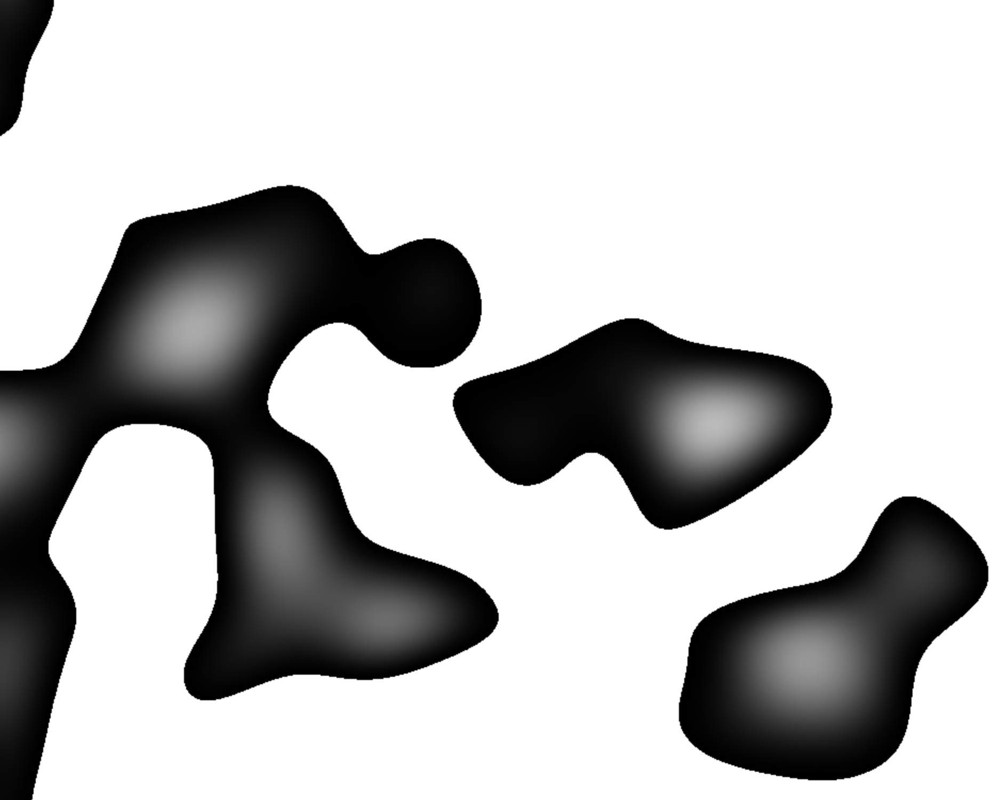

# Bubbles

[check it outttt](https://bubbles.danfishgold.com)

This is like, a really tiny project. Most of it is taken from
[Mike Bostock's Perlin noise implementation in webgl](https://observablehq.com/@mbostock/perlin-noise/2).

In [XOXO 2019](https://xoxofest.com) there was this beautiful animation that
played between talks (and other events) and I thought "oh, I wonder if it was
done using a hard break in the colormap of some Perlin noise (among other
things)", so I tried to recreate a very basic part of that animation. My thing
is _much_ more basic than the animation from the festival, but it was fun to
make and it reminds me of the festival and it helps me fall asleep :)

